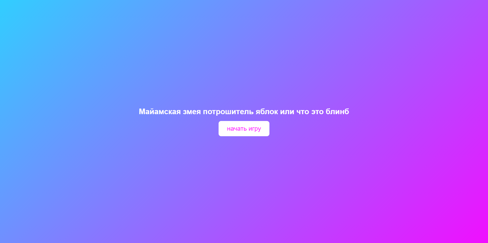
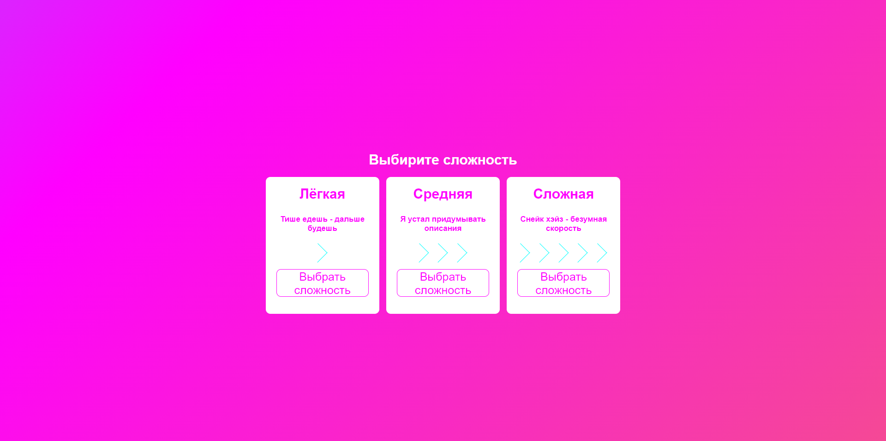
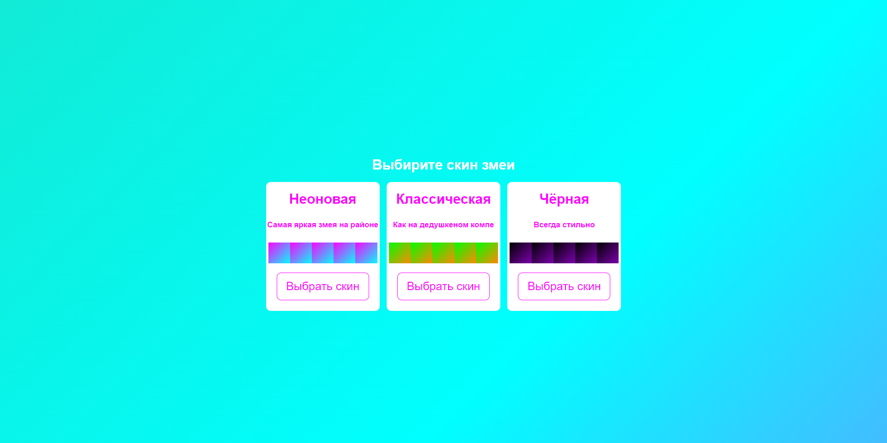
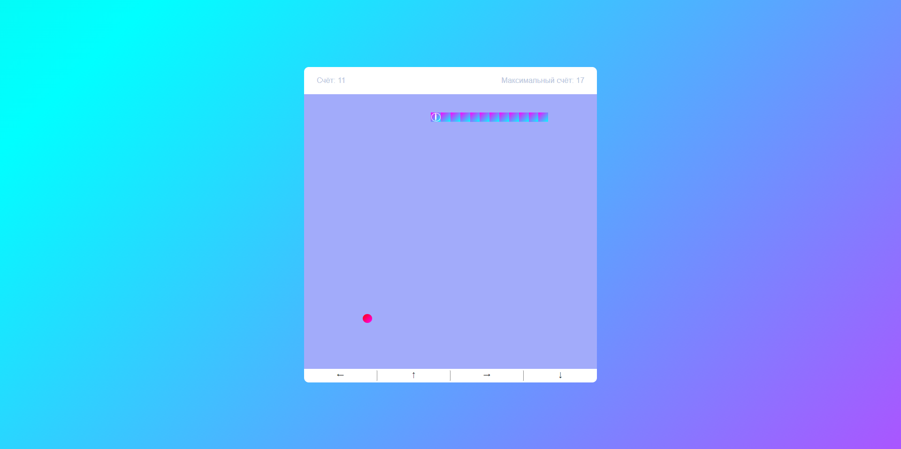
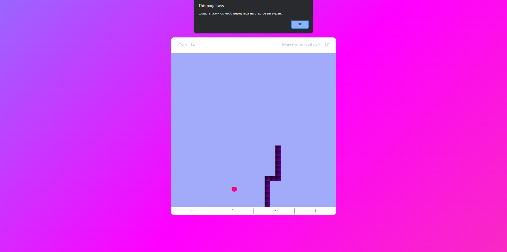

# [MIAMI__SNAKE](https://negatiff24.github.io/miami__snake/)

---

## Змейка обыкновенная

- Змейка: Игра происходит на поле 30 на 30, в котором нужно передвигаться и попытаться не со стенками либо с собой.  
- Яблоки: На поле постоянно спавниться яблоко, которое нужно съесть, чтобы увеличиться и зарабатывать очки опыта.  
- Счёт: За каждое съеденное яблоко вы получаете очко в счётчик. Слева отображается текущий счёт, справа максимально достигнутый счёт.

## Дополнительные функции

- Выбор сложности: от этого выбора зависит скорость змейки на поле. На выбор есть лёгкая, средняя и сложная сложность.  
- Выбор скина: на выбор даётся три скина на вкус игрока (неоновый/зелёный/чёрный).  
- Адаптивность: есть возможность играть на мобильном устройстве.

## Управление

- Компьютер: управление осуществляется стрелочками на клавиатуре.  
- Телефон: управление происходит по средствам нажатия кнопок со стрелками под игровым ролем.

## Как играть

- По ссылке, находящейся в самом начале. Ей можно спокойно делиться и заходить с любого устройства.  
- Скачать код из github напрямую, нажав <> Code -> Dowmload ZIP -> распаковать на своём компьютере.

## Скриншоты игры

  
  
  
  
  